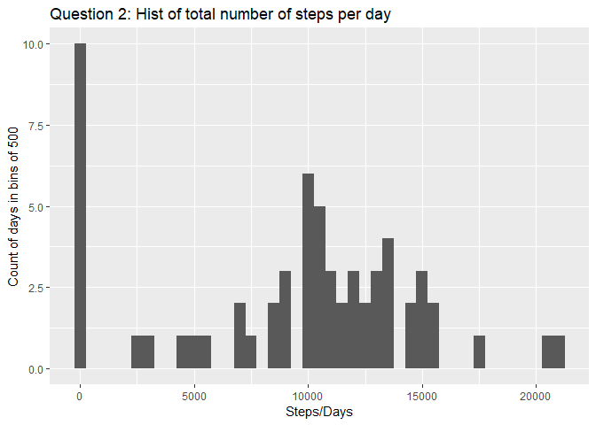
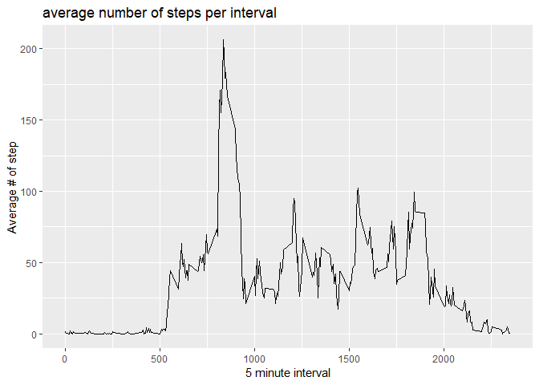
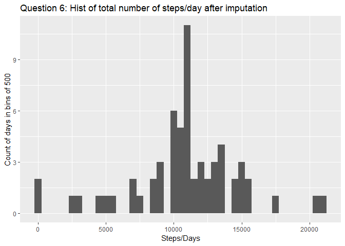

Reproduce\_Research\_Week2\_Peer\_Reviewed\_Assignment
================
N.B.
June 30, 2019

Question 1: Loading Data and preparing data
===========================================

``` r
fileurl <- "https://d396qusza40orc.cloudfront.net/repdata%2Fdata%2Factivity.zip"
zipfile <- "./repdata_data_activity.zip" 
# downloading the file as data.zip to the folder course4week4 under the working
# directory
filedir <- getwd()
unzip_path <- "./data"  # store unzipped file 
if (!file.exists(filedir)){
    dir.create(filedir)
}
download.file(fileurl,file.path(zipfile))
unzip(zipfile,exdir=unzip_path) ####### exdir is the extract directory ##########
datafile <- file.path(unzip_path,"activity.csv")

activity <- as_tibble(read.csv(datafile))

activity$date <- ymd(activity$date) #set date as a date
activity$weekend <- as.factor(ifelse(weekdays(activity$date)=="Saturday" | weekdays(activity$date)=="Sunday","weekend","weekday")) # make a weekend vs weekday varible
```

Question 2: Histogram of total steps per day
============================================

``` r
steps_per_day <- activity %>% group_by(date) %>% summarize(day.steps = sum(steps, na.rm = TRUE))

ggplot(steps_per_day) + geom_histogram(aes(x = day.steps), binwidth = 500) + 
    labs(title="Question 2: Hist of total number of steps per day", x = "Steps/Days", y = "Count of days in bins of 500")
```



Question 3: Mean and median of the total steps per day
======================================================

``` r
aggs.of.day <-  steps_per_day %>% 
    summarize(average.day = mean(day.steps, na.rm = TRUE), median.day = median(day.steps, na.rm = TRUE))
aggs.of.day
```

    ## # A tibble: 1 x 2
    ##   average.day median.day
    ##         <dbl>      <int>
    ## 1       9354.      10395

Question 4: Plot of number of steps taken by time (5 minute interval)
=====================================================================

``` r
avg.interval <-  activity %>% 
    group_by(interval) %>%
    summarize(avg.int = mean(steps, na.rm = TRUE))

with(avg.interval, qplot(interval, avg.int, geom = "line", 
                         xlab = "5 minute interval", ylab = "Average # of step",
                         main = "average number of steps per interval"))
```



Question 5: Which interval had highest number of steps on average
=================================================================

``` r
avg.interval[which(avg.interval$avg.int == max(avg.interval$avg.int)),]
```

    ## # A tibble: 1 x 2
    ##   interval avg.int
    ##      <int>   <dbl>
    ## 1      835    206.

Question 6: Impute missing data
===============================

``` r
table(complete.cases(activity))["FALSE"] # number of rows with a missing value
```

    ## FALSE 
    ##  2304

``` r
# mean imputation number of steps by interval
activity.impute <- activity %>%
    group_by(interval) %>%
    mutate(steps = replace(steps,
                           is.na(steps),
                           mean(steps, na.rm = TRUE)))

table(complete.cases(activity.impute))
```

    ## 
    ##  TRUE 
    ## 17568

Question 7: redo Q1 and 2 using imputed data and compare
========================================================

``` r
# redo steps in a day with imputed data
steps_day.impute <- activity.impute %>% group_by(date) %>% summarize(day.steps = sum(steps, na.rm = TRUE))

# redo graph
ggplot(steps_day.impute) + 
    geom_histogram(aes(x = day.steps), binwidth = 500) + 
    labs(title="Question 6: Hist of total number of steps/day after imputation", x = "Steps/Days", y = "Count of days in bins of 500")
```



``` r
# redo average
aggs.day.impute <-  steps_day.impute %>% 
    summarize(average.day = mean(day.steps, na.rm = TRUE), median.day = median(day.steps, na.rm = TRUE))

# mean and median pre imputation
aggs.of.day
```

    ## # A tibble: 1 x 2
    ##   average.day median.day
    ##         <dbl>      <int>
    ## 1       9354.      10395

``` r
# mean and median post imputation
aggs.day.impute
```

    ## # A tibble: 1 x 2
    ##   average.day median.day
    ##         <dbl>      <dbl>
    ## 1      10766.     10766.

The mean and median both went up, which makes sense, as they are no longer being pulled down by "zeros"

Question 8: Compare weekend vs weekday activity intervals
=========================================================

``` r
avg.int.impute <-  activity.impute %>% 
    group_by(interval, weekend) %>%
    summarize(avg.int = mean(steps, na.rm = TRUE))

with(avg.int.impute, qplot(interval, avg.int, geom = "line", facets = weekend~.,
                           xlab = "5 minute interval", ylab = "Average # of step", 
                           main = "average number of steps per interval by weekday vs weekend"))
```


